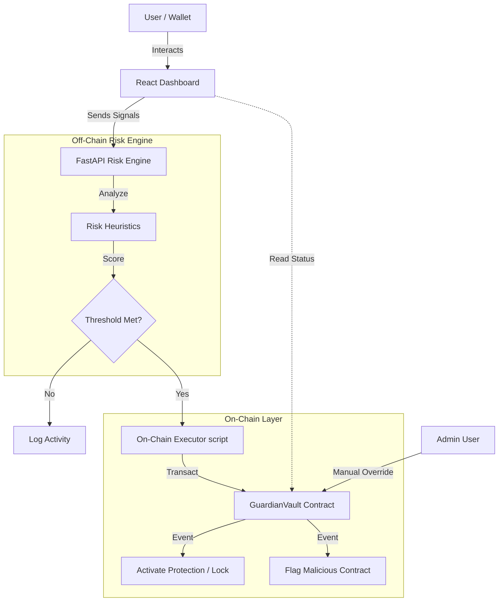
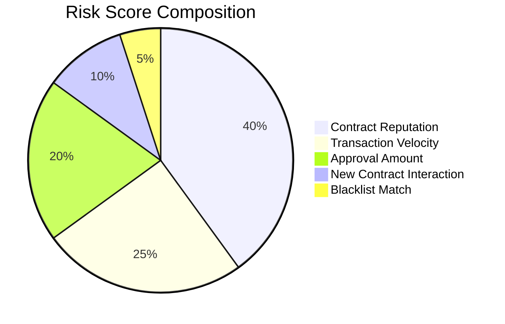

# 🛡️ Sentinel AI: Autonomous On-Chain Guardian

> **Deep Dive Documentation & Architecture Overview**

Sentinel AI is an advanced security infrastructure that combines off-chain AI risk analysis with on-chain execution capabilities. Designed to protect users from malicious contracts, rug pulls, and phishing attempts in real-time, Sentinel AI acts as a programmable guardian for your blockchain interactions.

---

## 🔍 System Architecture & Workflow

The system operates in a continuous monitoring loop, evaluating wallet signals and executing protective measures when risk thresholds are breached.

### High-Level Workflow
1. **Signal Ingestion**: The frontend and backend monitor wallet activity (transaction velocity, contract interactions, approvals).
2. **AI Risk Engine**: A Python-based engine (`backend/services.py`) evaluates these signals against a set of heuristics and historical data.
3. **Decision Matrix**: A risk score (0-100) is generated. If the score exceeds the user-defined threshold (e.g., 75/100), a protective action is triggered.
4. **On-Chain Execution**: The backend signs a transaction to the `GuardianVault` smart contract to either **Report Risk** or **Activate Protection** (Emergency Lock).
5. **Dashboard Visualization**: The React frontend displays live risk scores, system health, and allows for manual admin intervention.

### Architecture Diagram (Mermaid)

---

## 📊 Risk Factor Distribution (Pie Chart)

The AI engine weights different risk factors to calculate the final `Risk Score`.

---

## 📜 Smart Contracts: `GuardianVault.sol`

The `GuardianVault` is the on-chain enforcement layer. It stores risk states and executes protective logic.

### Core Functions

| Function Name | Roles | Description |
| :--- | :--- | :--- |
| **`activateProtection(address user)`** | Owner/Admin | **Emergency Lock**. Sets `protectionActive` to `true`. Used to freeze assets or interactions in a detected high-risk scenario. |
| **`reportRisk(address user, uint256 score)`** | Owner/Admin | Updates the on-chain risk score for a specific wallet. Emits `RiskDetected` event. |
| **`flagContract(address contractAddress)`** | Owner/Admin | Adds a contract address to the global blacklist (`flaggedContracts`). Used to block interactions with known malicious entities. |
| **`revokeHighRiskApproval(address user, address token)`** | Owner/Admin | *Simulation*: Intended to use `permit` or helper logic to revoke token allowences from compromised spenders. |
| **`emergencyLock(address user)`** | Owner/Admin | Alias for `activateProtection`. Provides an immediate "Red Button" response. |

### Contract State Variables
- `protectionActive`: Boolean flag indicating if the system is in lockdown mode.
- `riskScores`: Mapping of `address => uint256` storing the latest risk assessment.
- `flaggedContracts`: Mapping of `address => bool` identifying malicious contracts.

---

## 💻 Frontend & Admin Controls

The Dashboard (`DashboardPage.tsx`) is the mission control center.

### 1. Monitoring Panel
- **Risk Gauge**: Real-time visualization of the current risk score.
- **Live Feed**: A ticker showing scanned transactions and detected threats.
- **Active Modules**: Displays which protection modules (Phishing Detector, Rug Pull Monitor, etc.) are currently running.

### 2. Guardian Controls (Admin Panel)
*Added in recent update*
- **🚨 EMERGENCY LOCK (SOS)**: A dedicated button to trigger the `emergencyLock` function on-chain.
- **Flag Malicious Contract**: Input field to blacklist specific addresses via `flagContract`.
- **Revoke Approval**: Tool to target specific tokens and revoke their spending permissions.
- **Manual Risk Override**: Ability to manually set a risk score for a user if the AI engine is offline or incorrect.

---

## 🚀 Future Roadmap

The Sentinel AI roadmap focuses on decentralization to remove single points of failure.

### Phase 1: Enhanced Intelligence (Q3 2024)
- [ ] Integration of ZK-ML (Zero Knowledge Machine Learning) to prove risk assessments on-chain without revealing proprietary models.
- [ ] "Gas Spike Guard" module implementation to protect against front-running during high network congestion.

### Phase 2: Decentralization (Q4 2024)
- [ ] **Sentinel Nodes**: Turning the single Python backend into a network of nodes that reach consensus on risk scores.
- [ ] **DAO Governance**: Allowing token holders to vote on `flaggedContract` additions and parameter updates.

### Phase 3: Cross-Chain Expansion (2025)
- [ ] **CCIP Integration**: Using Chainlink CCIP to broadcast protection signals across multiple chains (e.g., if a wallet is compromised on Ethereum, lock it on Polygon automatically).
- [ ] **Mobile App**: Push notifications for critical risk alerts.

---

## 🛠️ Technical Stack

- **Frontend**: React (Vite), Framer Motion (Animations), Wagmi/Viem (Web3 Hooks), Lucide React (Icons).
- **Backend**: Python (FastAPI), Web3.py.
- **Smart Contracts**: Solidity (Hardhat/Foundry compatible).
- **Simulation**: JSON-based data pipeline for testing risk scenarios.

---

*Generated by GitHub Copilot on March 3, 2026*
