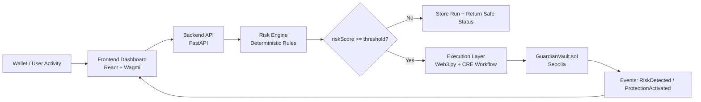

# SentinelAI — Autonomous Web3 Risk Guardian

SentinelAI is an autonomous wallet-defense system for Web3 users. It combines deterministic off-chain risk scoring with on-chain enforcement so that risky behavior can be detected early and protective actions can be executed automatically through Chainlink CRE workflows.

This repository contains a complete MVP: smart contract, backend API, risk engine, frontend dashboard, CRE workflow configs, and reproducible simulation artifacts.

## Why SentinelAI

Web3 users still face approval scams, malicious contracts, phishing flows, and high-velocity draining behavior. Most protections are reactive.

SentinelAI provides a proactive layer:
- Ingest wallet behavior signals
- Compute deterministic risk scores (reproducible rules)
- Trigger on-chain actions when threshold is crossed
- Persist artifacts for verification and audit

## Architecture (End-to-End)



## Deterministic Risk Model

Risk score rules currently implemented:
- +40 if `approvalAmountPercent > 80`
- +30 if `blacklistMatch == true`
- +20 if `contractReputationScore < 30`
- +10 if `transactionVelocity > velocityThreshold`
- +5 if `newContractInteraction == true`

Protection trigger: `riskScore >= 70`

This gives transparent and reproducible behavior for demos, testing, and audits.

## Smart Contract Details

Contract: `contracts/GuardianVault.sol`

Main functions:
- `reportRisk(address user, uint256 score)`
- `activateProtection(address user)`
- `flagContract(address contractAddress)`
- `revokeHighRiskApproval(address user, address token)`
- `emergencyLock(address user)`

Core state:
- `protectionActive`
- `riskScores`
- `flaggedContracts`

### Deployed Contract (from repository artifacts)

- Network: `Ethereum Sepolia`
- Chain ID: `11155111`
- Deployer: `0x6F9788e39e8C629f73C27db48cce03eA1fB9Acc1`
- Contract address: `0xD7840983B638cFcf9fC0CD32b358B02eb43E59Ef`
- Explorer: `https://sepolia.etherscan.io/address/0xD7840983B638cFcf9fC0CD32b358B02eb43E59Ef`
- Deployment tx hash (artifact): `fb31ca91659f2d5b2b0b6d2494404f7811d6e4334ccbb0d7cac561b40893f223`

Recent pipeline output example (`simulation-data/onchain_result.json`):
- `reportRiskTxHash`: `0x4c93228a7e654fa8d1b03852cd8b5d36d8831f5e1f97d964031b52bc7f1e04f2`
- `activateProtectionTxHash`: `0x1feae408635bf608be33e8d5e04a50e4607128481c2af10615e4a054ac33f204`

## Tech Stack

- Frontend: `React`, `TypeScript`, `Vite`, `Wagmi`, `Viem`
- Backend: `Python`, `FastAPI`, `Pydantic`
- Blockchain: `Solidity`, `Web3.py`, `Ethereum Sepolia`
- Agent/Workflow: `Chainlink CRE` (`sentinel-guardian` + `sentinel-guardian-go`)
- Tooling: `PowerShell`, `JSONL/JSON artifacts`, deterministic simulation scripts

## Local Setup

1. Install Python dependencies:

```bash
pip install -r requirements.txt
```

2. Configure env file:

```bash
cp .env.example .env
```

Required env values:
- `RPC_URL`
- `PRIVATE_KEY`
- `GUARDIAN_CONTRACT`
- `CHAIN_ID`

3. Run backend:

```bash
uvicorn backend.app:app --reload --port 8000
```

4. Run frontend:

```bash
cd frontend
npm install
npm run dev
```

## API Endpoints

- `GET /health`
- `POST /risk/evaluate`
- `POST /risk/execute`
- `POST /risk/pipeline`
- `GET /runs?limit=20`

## Reproducible Simulation

Local deterministic run:

```bash
python scripts/risk_engine.py --input simulation-data/sample_wallet.json --output simulation-data/risk_decision.json --threshold 70
python scripts/onchain_action.py
```

CRE simulation example:

```bash
cd sentinel-ai/sentinel-ai
cre workflow simulate sentinel-guardian-go --non-interactive --trigger-index 0
```

Artifacts generated in `simulation-data/` include:
- `risk_decision.json`
- `onchain_result.json`
- `demo_api_result.json`
- `proof_bundle.md`
- `backend_runs.jsonl`

## 6-Month Product Plan

### Month 1–2: Reliability & Security Hardening
- Improve key handling and secrets policy
- Add stronger validation for wallet signal payloads
- Expand test coverage for risk engine and API

### Month 3–4: Intelligence & Explainability
- Add explanation payloads for each score component
- Introduce configurable policy profiles
- Build richer dashboard telemetry and incident timelines

### Month 5–6: Decentralization & Expansion
- Multi-chain support groundwork and chain-specific policy routing
- CRE orchestration improvements and failover execution paths
- Governance-ready policy update flow for flags and thresholds

## Thank You

Thank you for reviewing SentinelAI. This project is built to demonstrate practical, autonomous wallet safety with transparent rules, verifiable on-chain actions, and reproducible outputs. Feedback, issues, and contributions are welcome.
